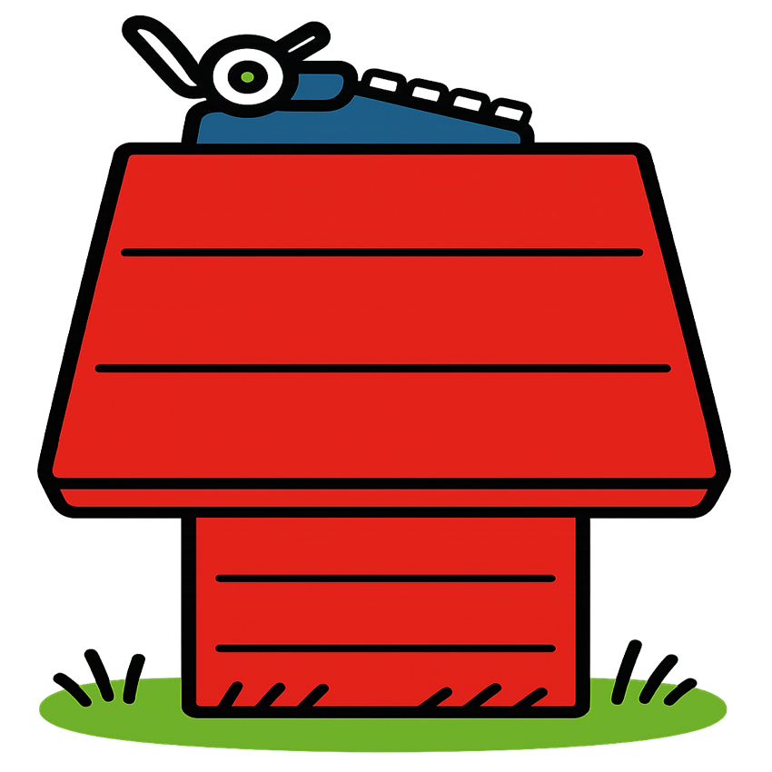

<!-- README.md for terry-b-cho.github.io -->

<p align="center">
  
</p>

<h1 align="center">
  <span style="color:#64ffda;">Terry B. Cho</span> <br/>
  <span style="font-size:1.2em; color:#8892b0;">Personal profile website</span>
</h1>

<p align="center">
  <b>Welcome Terry's Snoopy-inspired and interactive personal website!</b><br/>
  <i>Modern. Fun. Dynamic. Accessible. And full of hidden gems.</i>
</p>

<p align="center">
  
</p>

---
## 🚀 Live Demo

<p align="center">
  <a href="https://terry-b-cho.github.io" target="_blank" rel="noopener noreferrer">
    
  </a>
</p>

---

## ✨ Features

- **Woodstock-level UX/UI**: Glassmorphism, glowing effects, dark theme and pixel-perfect layouts.
- **Dynamic Hero Section**: Double-rimmed, interactive 3D headshot.
- **Glassmorphic Contact Section**: Google Map card + modern info card, fully responsive.
- **Accessibility**: Keyboard navigation, ARIA labels.
- **Apple-inspired Liquid Glass UI**: All major sections use a 4-layer glass container system for realistic, modern glass effects.
- **SVG-based Liquid Distortion**: Custom SVG filters create organic, animated glass warping for a true liquid look.
- **Responsive Glass Containers**: Glassmorphic cards adapt perfectly to all screen sizes, preserving clarity and depth.

---

## 🎁 Hidden Features & Easter Eggs

- <b>🧬 Animated Backgrounds:</b> Scroll between the neural network and DNA double helix for a smooth, with crossfades and glassy overlays.
- <b>🏠 Home Logo Button:</b> Click the house logo in the navbar to instantly scroll to the top, even on mobile.
- <b>🖱️ Scroll Indicator:</b> A perfectly centered, animated scroll cue appears only at the right moments.
- <b>🌀 Logo Carousel:</b> The carousel is dynamically duplicated for infinite, seamless animation—try resizing your window!

<p align="center">
  <b>🔍🔍 Rest of the hidden features are for you to find out 🔍🔍</b>
</p>

---

## 📱 Device Support

- Fully responsive: Looks and feels amazing on iPhone, iPad, Android, and desktop.
- Mobile-specific tweaks for perfect spacing, touch targets, and scroll cues.
- Responsive Navigation: Always-accessible, mobile-optimized navbar with a home-logo button.

---

## 🛠️ Tech Stack

- HTML5, CSS3 (with custom animations & glassmorphism)
- JavaScript (modular, accessible, and performant)
- Three.js (for scientific background animations)
- GitHub Pages (for blazing-fast deployment)

---

## 🧑‍💻 Local Development

```bash
# Clone the repo
$ git clone https://github.com/terry-b-cho/terry-b-cho.github.io.git
$ cd terry-b-cho.github.io

# Open index.html in your browser (no build step needed!)
```

---

## 🌐 Make Your Site Searchable on Google

> **Want your GitHub Pages site to show up on Google?**

### ✅ Quick Steps

1. **Add Google Verification Meta Tag**
   - Go to [Google Search Console](https://search.google.com/search-console/about)
   - Add your site (e.g., `https://yourusername.github.io`)
   - Choose the HTML tag method and copy the meta tag
2. **Paste the tag in your `<head>` (index.html):**
   ```html
   <meta name="google-site-verification" content="your-verification-code" />
   ```
3. **Push your changes to GitHub**
4. **Verify in Google Search Console**
5. **Request Indexing** (URL Inspection → Request Indexing)

### 🛠️ Pro SEO Tips
- Add a clear `<title>` and `<meta name="description">` in your `<head>`
- Use semantic HTML (e.g., `<main>`, `<section>`, `<nav>`, `<footer>`)
- Link your site from other indexed pages (social media, blogs, etc.)
- Avoid `noindex` in meta tags or `robots.txt`

---

## 👀 Credits & Inspiration

- Inspired by Snoopy.
- Built and designed by Snoop's best friend.

<p align="center">
  
</p> 